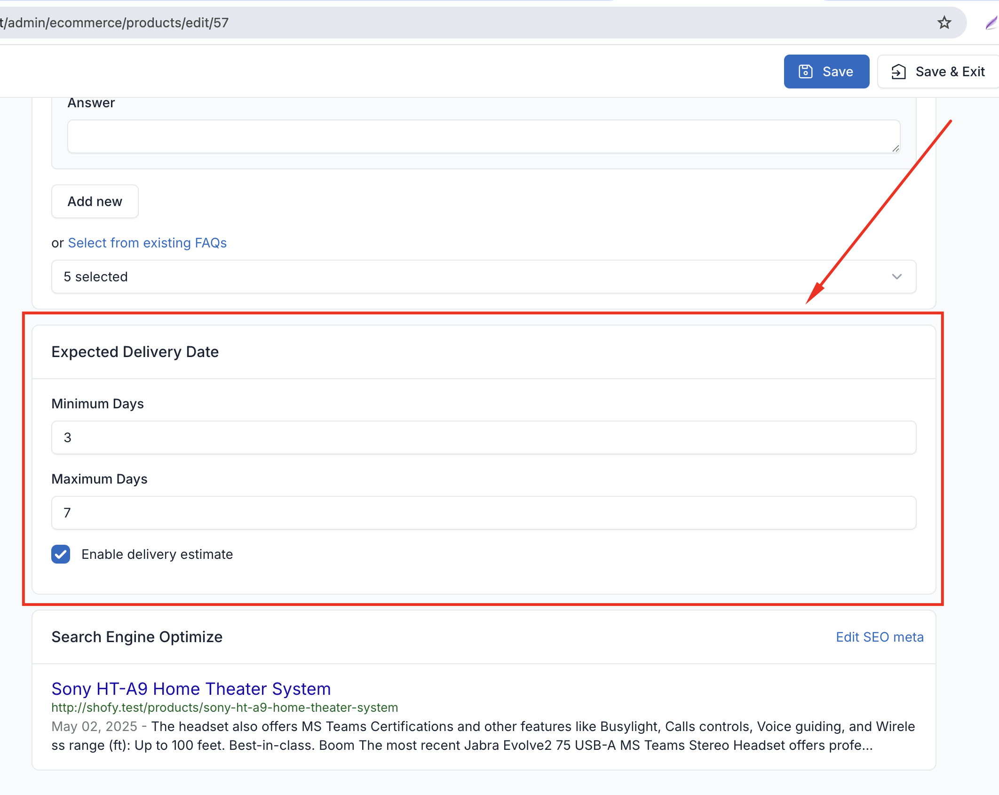
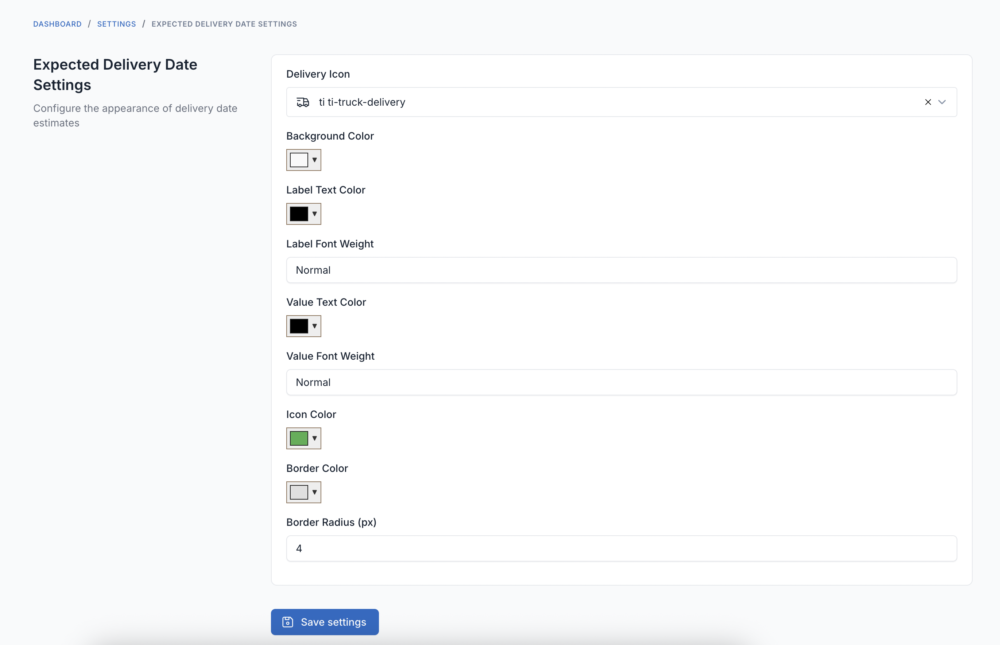
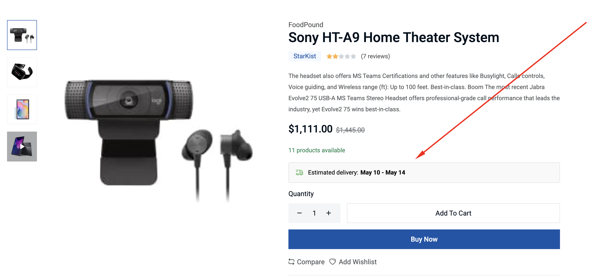

# FOB Expected Delivery Date

This is a plugin for Botble CMS that adds expected delivery date functionality to products. It works for all Botble Ecommerce scripts.

## Requirements

- Botble Core 7.5.0 or higher
- PHP 8.2 or higher

## Installation

1. Download the plugin
2. Extract to `platform/plugins/fob-expected-delivery-date`
3. Go to Admin -> Plugins and activate "FOB Expected Delivery Date"
4. Go to any product edit page and set delivery estimates

## Features

- Add expected delivery dates to products
- Custom delivery estimates per product
- Display delivery estimates on product pages
- Default delivery estimates for products without custom settings

  

  

## Usage

1. Edit a product in the admin panel
2. Find the "Expected Delivery Date" section
3. Set minimum and maximum delivery days
4. Enable/disable delivery estimates per product
5. Customize colors, icon... in Settings -> Expected Delivery Date

## Contributing

Please see [CONTRIBUTING](CONTRIBUTING.md) for details.

## Security

If you discover any security related issues, please email contact@friendsofbotble.com instead of using the issue tracker.

## Credits

- [Friends Of Botble](https://github.com/FriendsOfBotble)
- [All Contributors](../../contributors)

## License

The MIT License (MIT). Please see [License File](LICENSE) for more information. 
